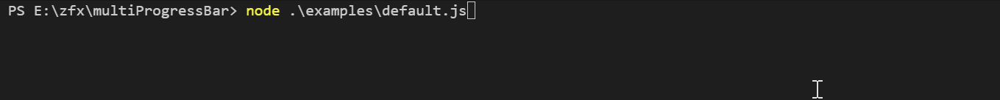
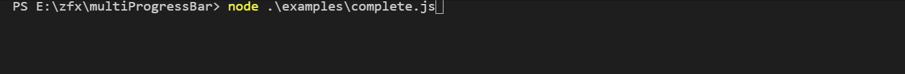
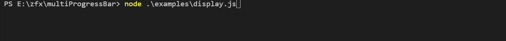
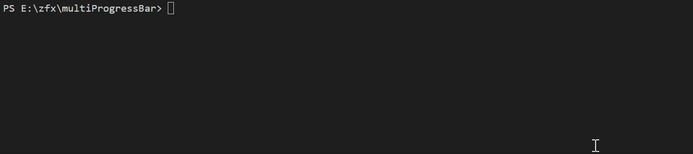
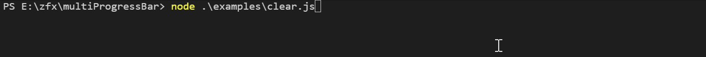

# Multi Progress Bar
multi-line progress bar output in terminal written in nodejs

## Install

```sh
$ npm i @zhangfuxing/multi-progress
```  

## Useage  

```js
const ProgressBars = require('@zhangfuxing/multi-progress');

const title = 'download files';
const total = 100;

const bars = new ProgressBars({
  title,
  // clear: true,
  complete: '*',
  incomplete: '.',
  display: '[:bar] :text :percent :time :completed/:total'
});

let completed1 = 0;
let completed2 = 0;

function downloading() {
  if (completed1 <= total || completed2 <= total) {
    completed1 += 1
    completed2 += 2
    bars.render([
      { completed: completed1, total, text: "file1" },
      { completed: completed2, total, text: "file2" }
    ]);

    setTimeout(function () {
      downloading();
    }, 100)
  }
}

downloading();
```  

More examples in the `examples` folder.

## Type definitions
```ts
declare class ProgressBars {
  /**
   * Options:
   *   - `title` optional, Progress bar title, default: ''
   *   - `width` optional, the displayed width of the progress, default: 50
   *   - `complete` optional, completion character, default: colors.bgGreen(' '), can use any string
   *   - `incomplete` optional, incomplete character, default: colors.bgWhite(' '), can use any string
   *   - `interval` optional, minimum time between updates in milliseconds, default: 16
   *   - `display` optional, What is displayed and display order, default: ':title :percent :bar :time :completed/:total'
   *   - `clear` optional, clear the bar on completion, default: false
   */
  constructor(options: ProgressBarOptions);

  /**
   * "render" the progress bar with completed and optional `total`
   * 
   *  - `bars` progress bars
   *  - `bars.completed` completed value
   *  - `bars.total` optional, total number of ticks to complete, default: 100
   *  - `bars.text` optional, text displayed per ProgressBar, default: ''
   */
  render(bars: []): void;

  /**
   * interrupt the progress bar and write a message above it
   */
  console(message: string | number): void;

  /**
   * end a progress bar.
   */
  end(): void;
}
```  

## Screenshots
default  
 
complete  
 
display: What is displayed and display order
 
console: interrupt the progress bar and write a message above it  
  
clear: clear the bar on completion  
  

More screenshots in the `screenshots` folder.
